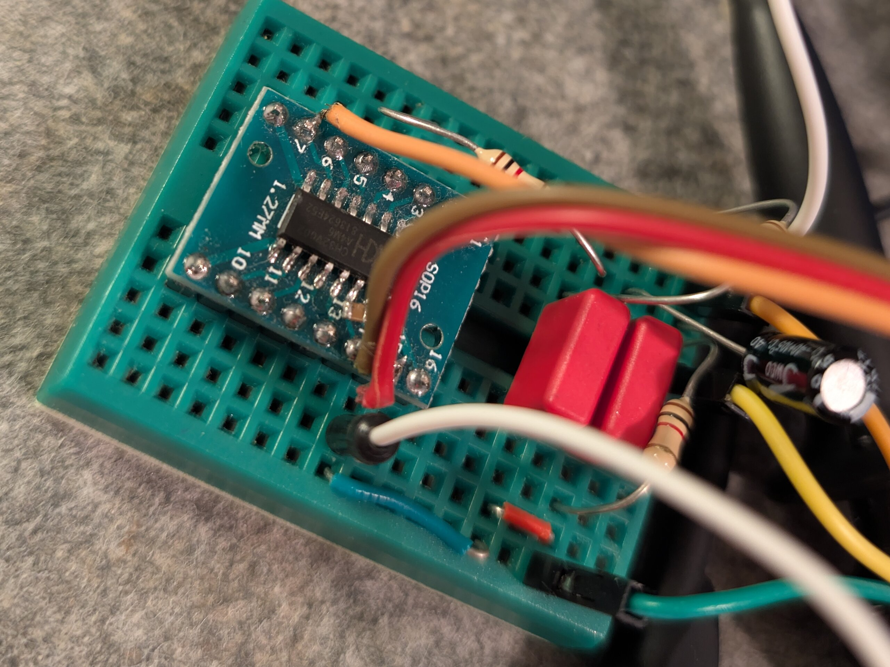

# MOD Player for RISC-V (CH32V00x)

This is a tiny experiment that plays tracker music ([MOD format](https://en.wikipedia.org/wiki/Module_file)) on a WCH CH32V00x RISC-V microcontroller. It is able to play any 4 channel MOD file (of which many are available on [The Mod Archive](https://modarchive.org/)), as long as it fits in the available flash memory. Note that S3M, IT, XM or other formats are not supported yet.

It is based on a modified version of the [MODPlay](https://github.com/prochazkaml/MODPlay) library and takes some inspiration from [BogdanTheGeek/ch32fun-audio](https://github.com/BogdanTheGeek/ch32fun-audio).

Memory footprint is around 4-5kb flash and ~1kb RAM.  The code would also work on CH32V003, but with increased CPU load due to the missing multiplication instruction. CH32V006 is recommended to allow using larger MOD files.

### Images

<div align="center">
  
</div>

### Video (play with sound)

<video controls height="480" style="display:block;margin:1rem auto;">
  <source src="media/movie.mp4" type="video/mp4">
  Your browser does not support the video tag. You can download the video here: [movie.mp4](media/movie.mp4)
</video>

[link](media/movie.mp4)

## Some Background

People often seem to associate low-cost microcontrollers with playing beeps and simple melodies. However, even if MCUs are usually manufactured on trailing-edge semiconductor manufacturing nodes, they are not exempt from Moores law. A "$0.10" 32-Bit Microcontroller today packs significantly more processing power and vastly more powerful peripherals compared to an AVR/PIC from decades ago.

The CH32V00x sports a very powerful timer that can run pulse width modulation (PWM) at 48MHz clock. By changing the duty cycle of the PWM signal, we can use it as a (crude) digital to analog converter. The comparator value that determines the duty cycle can be updated directly from SRAM using DMA. This allows for audio sample playback using zero CPU load.

<div align="center">
<pre>SRAM (Ring buffer) -> DMA -> Timer PWM -> RC Filter -> Audio Out</pre>
</div>

In this demo, I am using a 22.05kHz sample rate. This means that every PWM period is equal to 48MHZ/22050 = ~2172 clock cycles. This allows for 11 bit (2^11 = 2048) sample resolution, leaving some values unused. This is already quite decent for MOD audio playback, as the source samples before mixing are usually only 8 bit anyway. There are also plenty of options to improve audio quality further with clever digital signal processing.

Since the CPU is now idling, we can use it to render audio signals in real-time and update the ring buffer when it runs out of data. This can be implemented fully interrupt-driven, so that the music player can run in the background without blocking the main application. Here, I used ModPlay, which is a very tiny footprint MOD-Player that directly outputs into an audio buffer. I modified the source a little to generate mono and scale the signal directly to the PWM range.

The full pipeline looks like this:

<div align="center">
<pre>MODplay (INT driven) -> SRAM (Ring buffer) -> DMA -> Timer PWM (PC3) -> RC Filter -> Audio Out</pre>
</div>

I integrated a simple SysTick-based profiler to measure the interrupt handler execution time in real-time. Here is an example output while playing a MOD file which the inner loop running in SRAM for zero wait states execution:

```
IRQ: avg=936 us, min=824 us, max=1031 us, rate=172 Hz, CPU=16%
```
Everything in flash:

```
IRQ: avg=1434 us, min=1230 us, max=1549 us, rate=172 Hz, CPU=24%
```

This leaves ample processing time for other tasks, so even on this tiny MCU, we could use a MOD player to run music in the background.

I used a two stage RC low-pass filter (1kohm+10nF, 3dB@~15kHz) to smooth the PWM output. You can see the unfiltered PWM on the left and filtered audio signal on the right:

<div align="center">
  
  
</div>

There is still significant high-frequency noise visible in the filtered audio, but it seems the speakers do a good job of low pass filtering it out further. A better option may be to use a higher PWM frequency and implement noise shaping / delta-sigma modulation to recover SNR.

## Future work

This is just a quick experiment, so there are many possible improvements:
- Support for other tracker formats (S3M, XM, IT). I found [MODplay](https://www.chn-dev.net/Projects/MODPlay/) quite promising, but the memory footprint is significantly larger (~30kb flash)

- Using better digital signal processing techniques to improve audio quality (interpolation, filtering, noise shaping). For example one could go for 8bit PWM resolution at 176kHz sample rate to move all the PWM noise far away from the audio band. Delta-sigma modulation with dithering can then be used to recover the loss in resolution, even going beyond the 11 bit we are using now. A first estimate of achievable SNR vs bit depth is shown below:

<div align="center">
  <pre>MODplay (INT driven) -> Noise shaper -> SRAM (Ring buffer) -> DMA -> Timer PWM -> RC Filter -> Audio Out</pre>
</div>

<div align="center">
  
</div>


## Building and Usage

### Requirements

This is based on the [CH32V003Fun](https://github.com/CH32V003Fun/CH32V003Fun) framework. In addition you need access to a linux shell (WSL will do), as the Makefile used ``xxd`` and ``sed`` to convert the MOD file into a C header.

### 1. Clone Repository with Submodules

```bash
git clone --recursive <repository-url>
cd ModPlayRISCV
```
If you already cloned without `--recursive`:

```bash
git submodule update --init --recursive
```
Optionally: Replace `test.mod` with your own MOD file.
The one in the repo is called `intro_number_33.mod` from [modarchive.org](https://modarchive.org/index.php?request=view_by_moduleid&query=124036) by 'wotw'.

### 2. Build the Project and Flash to Device

```bash
make flash
```

This will:
- Generate `test_mod.h` from `test.mod` using `xxd`
- Compile the code with optimizations
- Create `main.bin` ready for flashing
- Flash the binary to the connected WCH-LinkE device

Optionally: Run `make monitor` to watch debugging output.

The audio output is streamed to `PC3` (inverted) and `P4` (non-inverted). Connect a speaker there. Add voltage divider or RC filter for better audio quality.

### Original Projects

- **MODPlay Engine**: [prochazkaml/MODPlay](https://github.com/prochazkaml/MODPlay)
  - Portable ProTracker MOD player library (BSD-3-Clause)
  - Modified for SRAM execution and mono output

- **CH32 Framework**: [cnlohr/ch32v003fun](https://github.com/cnlohr/ch32v003fun)
  - Minimal CH32V003 development framework

- **DMA Audio Inspiration**: [BogdanTheGeek/ch32fun-audio](https://github.com/BogdanTheGeek/ch32fun-audio)
  - Reference implementation for DMA-driven PWM audio

### Test MOD File

- **Filename**: `intro_number33.mod` (renamed to `test.mod`)
- **Source**: [modarchive.org](https://modarchive.org/index.php?request=view_by_moduleid&query=124036)
- **Format**: 4-channel ProTracker MOD
- **Size**: 5,874 bytes

## License

This project combines code from multiple sources:

- **MODPlay** (modplay.c/h): BSD-3-Clause License
- **CH32V003Fun**: Public Domain / MIT-style
- **Project Code** (main.c): Same as CH32V003Fun

See individual files for specific license information.
